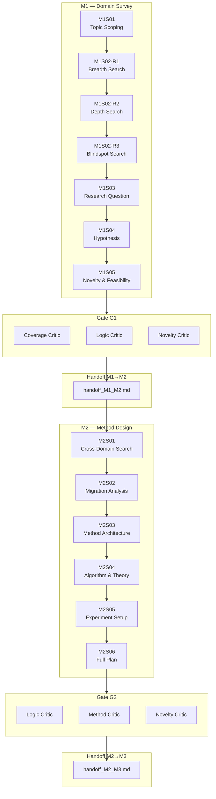
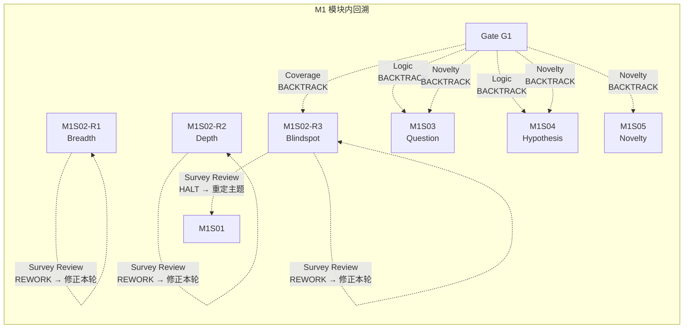
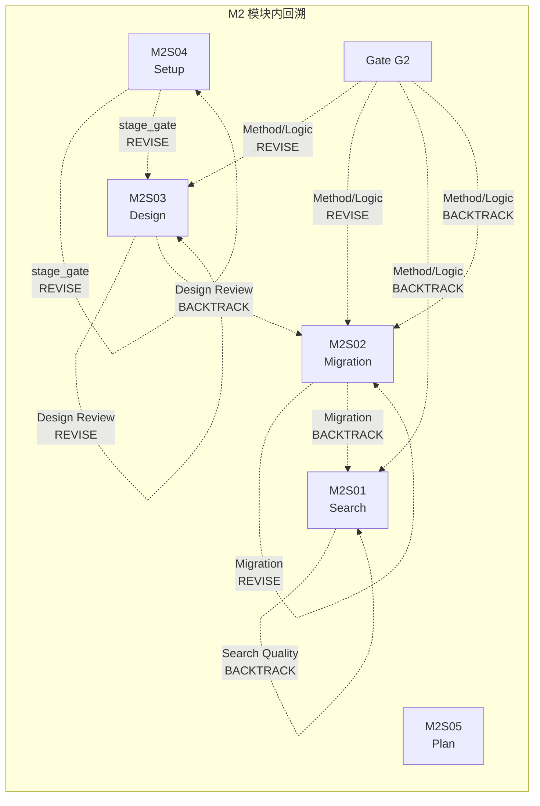
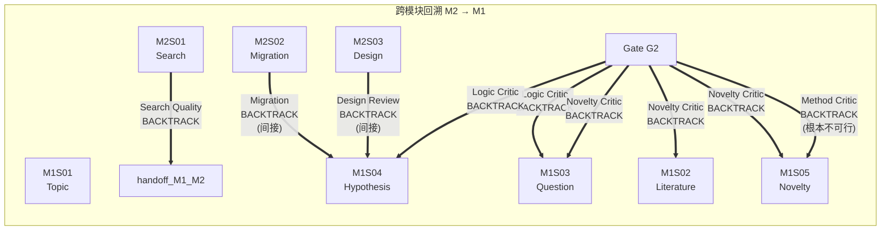

# M1 + M2 全流程回溯图

> **Analysis Date**: 2026-05-12
> **Scope**: M1 (Survey) + M2 (Method Design) 全阶段回溯分析
> **Key Insight**: 回溯不仅发生在模块内，M2 的多个审查点都可能触发跨模块回溯到 M1

---

## 一、完整流程 + 回溯节点总览（Mermaid）



---

## 二、模块内回溯（蓝色箭头）



**M1 模块内回溯规则**:

| 触发点 | Verdict | 回溯目标 | 原因 |
|--------|---------|---------|------|
| M1S02 Round 1-3 Survey Review | REWORK | 当前 Round | 搜索质量不足，修正本轮 |
| M1S02 Round 1-3 Survey Review | HALT | M1S01 | 主题范围错误，需重定主题 |
| Gate G1 Coverage Critic | BACKTRACK | M1S02-R3 | 文献覆盖率不足 |
| Gate G1 Logic Critic | BACKTRACK | M1S03 / M1S04 | Gap→Question→Hypothesis 逻辑断裂 |
| Gate G1 Novelty Critic | BACKTRACK | M1S03 / M1S04 / M1S05 | 新颖性声明不实或遗漏相关工作 |

---

## 三、M2 模块内回溯（绿色箭头）



**M2 模块内回溯规则**:

| 触发点 | Verdict | 回溯目标 | 原因 |
|--------|---------|---------|------|
| M2S01 Search Quality Reviewer | REVISE | M2S01 | 搜索维度/方案池不足 |
| M2S01 Search Quality Reviewer | BACKTRACK | M2S01 | 搜索方向完全错误 |
| M2S02 Migration Reviewer | REVISE | M2S02 | 映射/改进点分析不足 |
| M2S02 Migration Reviewer | BACKTRACK | M2S01 | 跨域方案不适用，需重新搜索 |
| M2S03 Design Reviewer | REVISE | M2S03 | 架构设计不一致/不完整 |
| M2S03 Design Reviewer | BACKTRACK | M2S02 | 方案漂移，需重新分析 |
| M2S04 Design Reviewer | REVISE | M2S04 | 算法设计不一致/不完整 |
| M2S04 Design Reviewer | BACKTRACK | M2S03 | 架构无法支撑算法 |
| M2S05 stage_gate | REVISE | M2S05 | 实验设置不完整 |
| Gate G2 Method Critic | REVISE | M2S04 / M2S03 / M2S05 | 方法可修复的问题 |
| Gate G2 Method Critic | BACKTRACK | M2S01 / M2S02 / M2S03 | 方法根本性缺陷 |

---

## 四、跨模块回溯（红色箭头）—— M2 → M1



**跨模块回溯规则（M2 → M1）**:

| 触发点 | Verdict | 回溯目标 | 根本原因 | 典型场景 |
|--------|---------|---------|---------|---------|
| **M2S01 Search Quality Reviewer** | **BACKTRACK** | **M2S01** | Gap→技术问题映射错误 | M1 的 Gap 定义正确，但 M2S01 拆解方向错误；如需刷新交接，在 `handoff_updates` 中标记 `handoff_M1_M2.md` |
| **M2S02 Migration Reviewer** | **BACKTRACK** (间接) | **M1S04** | M1 假设与跨域方案完全不匹配 | 假设 H1 在技术上不可被任何跨域方案验证 |
| **M2S03 Design Reviewer** | **BACKTRACK** (间接) | **M1S04** | 核心假设无法被架构验证 | 假设 H1 的预测无法通过 M2S03 的架构得到检验 |
| **M2S04 Design Reviewer** | **BACKTRACK** (间接) | **M1S04** | 核心假设无法被算法验证 | 假设 H1 的预测无法通过 M2S04 的算法得到检验 |
| **Gate G2 — Logic Critic** | **BACKTRACK** | **M1S03 / M1S04** | M1 假设的逻辑链条断裂 | M2 的方法论无法逻辑自洽地验证 M1 假设 |
| **Gate G2 — Novelty Critic** | **BACKTRACK** | **M1S02 / M1S03 / M1S05** | M1 遗漏关键相关工作 | 核心想法已被做过；或新颖性声明被推翻 |
| **Gate G2 — Method Critic** | **BACKTRACK** | **M1S05** | M1 可行性评估根本性错误 | M1S05 判断为 PROCEED，但方法实际上完全不可行 |

---

## 五、回溯决策矩阵

### 5.1 "应该回溯到哪里？"决策树

```
审查发现问题
    │
    ├── 问题在 Gap→技术问题的拆解/映射层面？
    │       ├── 拆解有误但 Gap 本身正确？ → 回溯到 M2S01（重新拆解，并刷新 handoff_M1_M2.md）
    │       └── Gap 本身定义错误/不具体？ → 回溯到 M1S03 或 M1S02
    │
    ├── 问题在跨域方案不适用/不可迁移？
    │       ├── 方案选择错误？ → 回溯到 M2S02（重新分析）
    │       └── 搜索范围不足？ → 回溯到 M2S01（重新搜索）
    │
    ├── 问题在假设与方法不匹配？
    │       ├── 架构设计可修改？ → 回溯到 M2S03
    │       ├── 算法设计可修改？ → 回溯到 M2S04
    │       └── 方法根本性不可行？ → 回溯到 M1S04（重新设计假设）
    │
    ├── 问题在逻辑链条断裂？
    │       ├── Question→Hypothesis 断裂？ → 回溯到 M1S03/M1S04
    │       └── Gap→Question 断裂？ → 回溯到 M1S02/M1S03
    │
    ├── 问题在遗漏相关工作？
    │       ├── 领域内有遗漏？ → 回溯到 M1S02（补充文献）
    │       └── 跨域有遗漏？ → 回溯到 M2S01（补充搜索）
    │
    ├── 问题在算法设计不匹配？
    │       ├── 算法可修改？ → 回溯到 M2S04
    │       └── 架构本身有问题？ → 回溯到 M2S03
    │
    └── 问题在可行性评估错误？
            └── M1S05 判断为 PROCEED 但实际不可行？ → 回溯到 M1S05
```

### 5.2 回溯深度判定

| 回溯深度 | 目标 | 适用场景 |
|---------|------|---------|
| **浅层** (同一 Stage) | M2S0X → M2S0X | REVISE：当前 Stage 产出可修复 |
| **中层** (模块内) | M2S0X → M2S0Y | BACKTRACK：需要重新分析/搜索/设计 |
| **深层** (跨模块到 M2S01 + handoff 刷新) | M2 → M2S01 | Gap 拆解方向错误，但 M1 产出正确；如需刷新交接，写入 `handoff_updates` |
| **深层** (跨模块到 M1 Stage) | M2 → M1S0X | M1 核心结论（Gap/Question/Hypothesis）有误 |
| **终止** (HALT) | 终止项目 | 主题不可行或学术诚信问题 |

---

## 六、关键设计洞察

### 6.1 handoff_M1_M2.md 是跨模块回溯的交接刷新对象，而不是回溯目标

```
M1 ──→ handoff_M1_M2 ──→ M2
       ↑
       └── 回溯时需刷新该交接文件，而不是把它当成 stage
```

- **不直接回溯到 handoff 文件作为 stage**：如果问题只是"M1 的 Gap 被 M2 误解了"，应回溯到 M2S01 重新拆解，并在 `handoff_updates` 中注明 `handoff_M1_M2.md` 需要刷新
- **直接回溯到 M1 内部 Stage**：只有当 M1 的 Gap 定义本身有误时，才需要深入 M1S03 / M1S02
- **好处**：保持回溯目标可执行，同时保留 handoff 作为交接刷新记录

### 6.2 M2S02 Migration Reviewer 是跨模块回溯的"传感器"

Migration Reviewer 审查跨域方案与 M1 假设的匹配度。如果发现：
- **所有跨域方案都无法验证 M1 假设** → 很可能是 M1S04 假设设计有问题 → 触发跨模块回溯
- **部分方案可以验证但映射有缺陷** → M2 内部问题 → 模块内回溯

### 6.3 M2S03/M2S04 Design Reviewer 是方法质量的"双保险"

- **M2S03 Design Reviewer**：审查架构设计是否忠实于 M2S02 的思想映射
- **M2S04 Design Reviewer**：审查算法设计是否与架构一致、是否可实验化
- 两次审查形成"承上启下"的双层质量关卡

Migration Reviewer 审查跨域方案与 M1 假设的匹配度。如果发现：
- **所有跨域方案都无法验证 M1 假设** → 很可能是 M1S04 假设设计有问题 → 触发跨模块回溯
- **部分方案可以验证但映射有缺陷** → M2 内部问题 → 模块内回溯

### 6.4 Gate G2 是跨模块回溯的"最后防线"

Gate G2 的 Novelty Critic 和 Logic Critic 都可能发现 M1 的根本性问题：
- **Novelty Critic**: "这个核心想法在 [某篇 M1 遗漏的论文] 中已经做了" → M1S02 文献调研不充分
- **Logic Critic**: "M2 的方法无法验证 M1 的假设 H1" → M1S03/M1S04 逻辑设计有误

### 6.5 回溯不是"失败"，而是"验证"

M2 的核心使命是"基于 M1 的 Gap 寻找跨域解决方案"。如果 M2 发现：
- M1 的 Gap 在跨域视角下无解 → 这不是 M2 的失败，而是 M1 的假设需要修正
- M2 的回溯到 M1 恰恰证明了 M1-M2 分层设计的价值：M1 发现问题，M2 验证问题的可解性

---

## 七、当前实现 vs 理想回溯图的差距

| 回溯路径 | 理想设计 | 当前实现 | 差距 |
|---------|---------|---------|------|
| M2S01 Search Quality → M2S01 REVISE | ✅ | ✅ REVISE 触发 backtrack | 已修复 |
| M2S01 Search Quality → handoff BACKTRACK | ✅ | ✅ backtrack 支持跨模块 | 已支持 |
| M2S02 Migration → M2S02 REVISE | ✅ | ✅ REVISE 触发 backtrack | 已修复 |
| M2S02 Migration → M2S01 BACKTRACK | ✅ | ✅ | 已支持 |
| M2S03 Design → M2S03 REVISE | ✅ | ✅ REVISE 触发 backtrack | 已修复 |
| M2S03 Design → M2S02 BACKTRACK | ✅ | ✅ | 已支持 |
| M2S04 Design → M2S04 REVISE | ✅ | ✅ REVISE 触发 backtrack | 已支持 |
| M2S04 Design → M2S03 BACKTRACK | ✅ | ✅ | 已支持 |
| M2S04 Design → M1S04 BACKTRACK (间接) | ✅ | ✅ backtrack 支持跨模块 | 已支持 |
| Gate G2 → M2S0X REVISE | ✅ | ✅ REVISE 支持 target_stage | 已修复 |
| Gate G2 → M2S01/M2S02/M2S03/M2S04 BACKTRACK | ✅ | ✅ | 已支持 |
| Gate G2 → M1S0X BACKTRACK | ✅ | ✅ backtrack 支持跨模块 | 已支持 |

### 关键差距：Gate G2 → M1 跨模块回溯

**验证**: `backtrack()` 使用 `all_stages = [s for stages in MODULE_STAGES.values() for s in stages]`，支持跨模块回溯（M1 stages 在 M2 stages 之前）。模块状态管理通过遍历 `all_modules` 自动标记 reopened。

**当前状态**: 跨模块回溯已完全支持。
