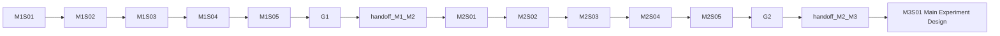

# M1-M2 Backtrack Diagram — Current Topology

## Backtrack Targets

| Problem | Target |
|---------|--------|
| Source coverage or gap evidence invalid | M1S02 / M1S03 |
| Hypothesis cannot be operationalized | M1S04 |
| Cross-domain search too narrow | M2S01 |
| Migration mapping invalid | M2S02 |
| Architecture or algorithm unsound | M2S03 / M2S04 |
| Dataset, metric, baseline setup invalid | M2S05 |
| Main experiment details missing baseline reference values | M3S01 |

M2 does not own the full main experiment plan. Detailed main experiment design starts in M3S01; ablation and robustness analysis starts in M4.
