# M1-M2-M3 Backtrack Diagram — Current Topology

```mermaid
flowchart LR
  M1[M1 Problem + Hypothesis] --> G1
  G1 --> M2S01 --> M2S02 --> M2S03 --> M2S04 --> M2S05 --> G2
  G2 --> M3S01 --> R31[M3S01 review] --> M3S02 --> R32[M3S02 review] --> M3S03 --> R33[M3S03 reviews] --> M3S04 --> R34[M3S04 review] --> M3S05 --> R35[M3S05 review] --> G3
```

## M3 Stage Ownership

| Stage | Owner | Purpose |
|-------|-------|---------|
| M3S01 | Experiment Agent | Main experiment design only: dataset, metric, baseline reference values, same-condition protocol |
| M3S02 | Experiment Agent | Dataset acquisition, environment, implementation, sandbox/resource plan |
| M3S03 | Experiment Agent | Baseline acquisition, complete reproduction or official import, metric contract, smoke test, lock manifest |
| M3S04 | Experiment Agent | Main experiment execution with trained checkpoints and runtime supervision |
| M3S05 | Analysis Agent | Result validation, KEEP/FIX/BACKTRACK decision, evidence packaging |

## Backtrack Targets

| Failure | Target |
|---------|--------|
| Metric protocol wrong for dataset/scenario | M2S05 |
| Main experiment lacks concrete baseline reference values | M3S01 |
| Dataset cannot be acquired after recorded attempts | M3S02 with HALT/non-PASS |
| Baseline code/weights/checkpoint unavailable or simplified | M3S03 with HALT/non-PASS or backtrack |
| Training incomplete, random/E0 weights, or abnormal results hidden | M3S04 / M3S05 |
| Main result needs ablation/robustness/mechanism evidence | M4S02/M4S03, not M3 baseline lock |

G3 must not pass while any required experiment, baseline, dataset, checkpoint, or trained-weight evidence is pending, ambiguous, or unavailable.
