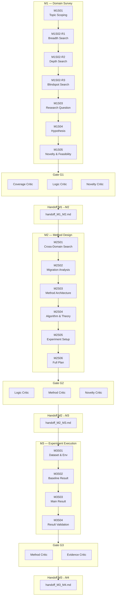
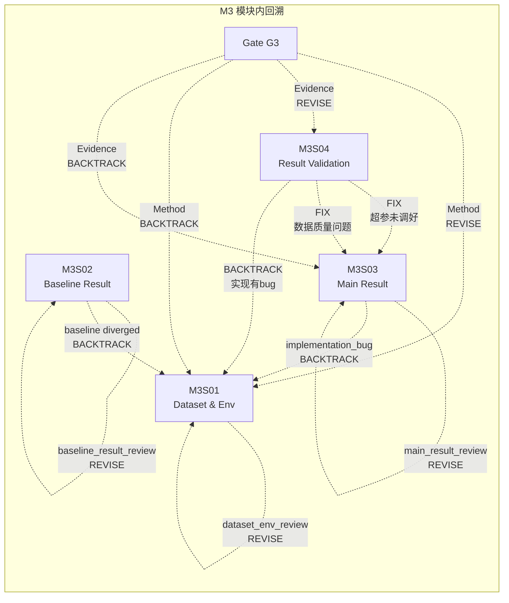
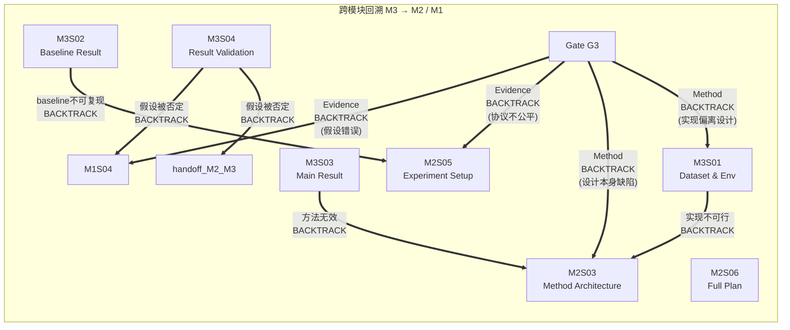

# M1 + M2 + M3 全流程回溯图

> **Analysis Date**: 2026-05-12
> **Scope**: M1 (Survey) + M2 (Method Design) + M3 (Experiment) 全阶段回溯分析
> **Key Insight**: M3 是"证据生产"模块，其回溯不仅发生在模块内，还可能因证据不足而触发跨模块回溯到 M2 或 M1

---

## 一、完整流程 + 回溯节点总览（Mermaid）



---

## 二、M3 模块内回溯（蓝色箭头）



**M3 模块内回溯规则**:

| 触发点 | Verdict | 回溯目标 | 原因 |
|--------|---------|---------|------|
| M3S01 dataset_env_review | REVISE | M3S01 | 数据集、实验环境或依赖配置不足 |
| M3S02 baseline_result_review | REVISE | M3S02 | baseline 结果、contract 或 smoke test 有问题 |
| M3S02 baseline diverged | BACKTRACK | M3S01 | 环境/依赖问题导致 baseline 无法复现 |
| M3S03 main_result_review | REVISE | M3S03 | 主实验结果不足、未超过 baseline 或记录不完整 |
| M3S03 implementation_bug | BACKTRACK | M3S01 | 代码有 bug 需修复 |
| M3S04 超参未调好 | FIX | M3S03 | 增加 seed、调整超参 |
| M3S04 数据质量问题 | FIX | M3S03 / M3S01 | 修复泄露或不稳定问题 |
| M3S04 实现有 bug | BACKTRACK | M3S01 | 代码实现错误 |
| Gate G3 Method Critic | REVISE | M3S01 | 实现与设计有偏差 |
| Gate G3 Evidence Critic | REVISE | M3S04 | 统计方法需修正 |
| Gate G3 Evidence Critic | BACKTRACK | M3S03 | 证据不足，需补充实验 |

---

## 三、跨模块回溯（红色箭头）—— M3 → M2 / M1



**跨模块回溯规则（M3 → M2 / M1）**:

| 触发点 | Verdict | 回溯目标 | 根本原因 | 典型场景 |
|--------|---------|---------|---------|---------|
| **M3S01 实现不可行** | **BACKTRACK** | **M2S03** | M2 的方法架构在实现层面不可行 | 算法步骤无法转化为有效代码 |
| **M3S02 baseline 不可复现** | **BACKTRACK** | **M2S05** | M2 选择的 baseline 实际上不可验证 | 官方代码有不可修复的 bug |
| **M3S03 方法无效** | **BACKTRACK** | **M2S03** | 方法实现正确但效果不达预期 | 合理实现下仍无法超过 baseline |
| **M3S04 假设被否定** | **BACKTRACK** | **M1S04** | M1 的假设与实验结果矛盾 | 核心假设 H1 被实验否定 |
| **Gate G3 Method** | **BACKTRACK** | **M3S01** | 实现与设计有重大偏差 | 代码实现偏离 M2S03 设计 |
| **Gate G3 Method** | **BACKTRACK** | **M2S03** | 设计本身有缺陷，实现已尽力 | 方法设计存在逻辑漏洞 |
| **Gate G3 Evidence** | **BACKTRACK** | **M2S05** | 实验协议设计不公平 | baseline 和本文方法评估协议不一致 |
| **Gate G3 Evidence** | **BACKTRACK** | **M1S04** | 假设设计错误 | 假设在实验条件下不可检验或被否定 |

---

## 四、回溯决策矩阵

### 4.1 "应该回溯到哪里？"决策树（M3 场景）

```
M3 审查发现问题
    │
    ├── 问题在代码实现层面？
    │       ├── 实现有 bug 但方法设计正确？ → FIX → M3S01 或 M3S03
    │       ├── 实现忠实但设计在实现中不可行？ → BACKTRACK → M2S03
    │       └── 实现偏离了 M2 设计？ → BACKTRACK → M3S01（重新实现）
    │
    ├── 问题在 baseline？
    │       ├── baseline 环境/依赖问题？ → FIX → M3S02 或 M3S01
    │       ├── baseline 官方代码不可运行？ → BACKTRACK → M2S05（更换 baseline）
    │       └── baseline 指标与论文差距大？ → 检查环境 → 必要时 BACKTRACK → M3S01
    │
    ├── 问题在实验结果？
    │       ├── 超参数未调好？ → FIX → M3S03
    │       ├── 训练不稳定？ → FIX → M3S03 或 M3S01
    │       ├── 样本量不足？ → FIX → M3S03（增加 seed）
    │       ├── 统计不显著但趋势好？ → FIX → M3S03（扩大规模）
    │       └── 方法合理实现但效果不达预期？ → BACKTRACK → M2S03（重新设计方法）
    │
    ├── 问题在假设验证？
    │       ├── 假设被实验否定？ → BACKTRACK → M1S04（修正假设）
    │       ├── 假设不可检验？ → BACKTRACK → M1S04 或 M2S05
    │       └── 实验设计无法验证假设？ → BACKTRACK → M2S05 或 M2S06
    │
    └── 问题在实验协议公平性？
            ├── 数据集/划分不一致？ → FIX → M3S02 或 M3S01
            └── 协议在 M2 设计时就不公平？ → BACKTRACK → M2S05
```

### 4.2 回溯深度判定（含 M3）

| 回溯深度 | 目标 | 适用场景 |
|---------|------|---------|
| **浅层** (同一 Stage) | M3S0X → M3S0X | REVISE：当前 Stage 产出可修复 |
| **中层** (模块内) | M3S0X → M3S0Y | BACKTRACK：需要重新实现/验证/实验 |
| **深层** (跨模块到 M2) | M3 → M2S0X | M2 的方法设计或实验协议有缺陷 |
| **深层** (跨模块到 M1) | M3 → M1S0X | M1 的假设或可行性评估有误 |
| **终止** (HALT) | 终止项目 | 主题不可行或学术诚信问题 |

---

## 五、M3 关键设计洞察

### 5.1 M3S02 是 M3 的"质量守门员"

Baseline Result Review 阶段的独立设计（从 M3S01 拆分出来）确保了：
- **不浪费主实验资源**：如果 baseline 有问题，在冒烟阶段就拦截
- **比较基准可信**：metric contract 标准化，下游无需重新验证
- **Comparator-first 原则**：优先复用已有验证结果，避免重复劳动

### 5.2 M3S04 是"诚实性守门员"

Analysis Agent 在 M3S04 执行结果验证，其独立性（非 Experiment Agent）确保了：
- **执行者不自审**：跑实验的人不自己判定结果好坏
- **统计视角**：Analysis Agent 的专业能力确保统计检验的恰当性
- **KEEP/FIX/BACKTRACK 决策的严肃性**：不是"继续试试"，而是明确的有依据的决策

### 5.3 M3 → M2 回溯是"设计验证"

M3 发现方法不可行或效果不达预期时回溯到 M2，这不是 M3 的失败，而是：
- **M2 设计在真实世界中的验证**：纸面设计（M2）与实际运行（M3）之间存在天然鸿沟
- **M2-M3 分层设计的价值**：M2 负责"设计正确的方法"，M3 负责"验证方法是否真的能工作"
- **早期止损**：在 M3 发现问题并回溯，比到 M4/M5 才发现要节省大量时间

### 5.4 M3 → M1 回溯是"假设检验"

当实验结果否定 M1 的核心假设时：
- **这是科学研究的正常过程**：假设被否定也是有效结果
- **M3 的责任是诚实标记**：不隐瞒、不粉饰
- **M1 的价值在于"提出可检验的假设"**：即使被否定，问题的提出和检验过程仍有价值

---

## 六、当前实现 vs 理想回溯图的差距

| 回溯路径 | 理想设计 | 当前实现 | 差距 |
|---------|---------|---------|------|
| M3S01 dataset_env_review → M3S01 REVISE | ✅ | ✅ REVISE 触发 backtrack | 已支持 |
| M3S02 baseline_result_review → M3S02 REVISE | ✅ | ✅ backtrack 支持 | 已支持 |
| M3S03 main_result_review → M3S03 REVISE | ✅ | ✅ REVISE 触发 backtrack | 已支持 |
| M3S02 → M3S01 BACKTRACK | ✅ | ✅ backtrack 支持跨模块内 | 已支持 |
| M3S03 → M3S01 BACKTRACK | ✅ | ✅ backtrack 支持跨模块内 | 已支持 |
| M3S04 FIX → M3S03 | ✅ | ✅ REVISE 支持 target_stage | 已支持 |
| M3S04 BACKTRACK → M3S01 | ✅ | ✅ backtrack 支持跨模块内 | 已支持 |
| M3S04 BACKTRACK → M2S03 | ✅ | ✅ backtrack 支持跨模块 | 已支持 |
| M3S04 BACKTRACK → M1S04 | ✅ | ✅ backtrack 支持跨模块 | 已支持 |
| Gate G3 → M3S0X REVISE | ✅ | ✅ REVISE 支持 target_stage | 已支持 |
| Gate G3 → M3S0X BACKTRACK | ✅ | ✅ backtrack 支持跨模块内 | 已支持 |
| Gate G3 → M2S0X BACKTRACK | ✅ | ✅ backtrack 支持跨模块 | 已支持 |
| Gate G3 → M1S0X BACKTRACK | ✅ | ✅ backtrack 支持跨模块 | 已支持 |

### 当前状态

1. **M3 4 Stage 架构**：`project.py` 已支持 M3S01-M3S04。
2. **Stage-level Review**：M3S01/M3S02/M3S03 分别接入 dataset/env、baseline result、main result 审查器。
3. **Gate G3**：Method + Evidence Critic 仍作为模块级最终审查。

---

> **下一步**: 执行 M3S01 真实实验准备，并由对应 Stage Review 审查是否可推进。
